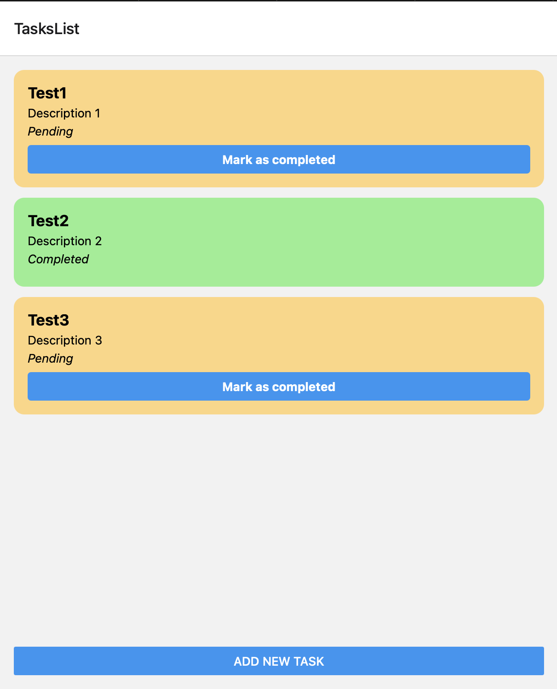
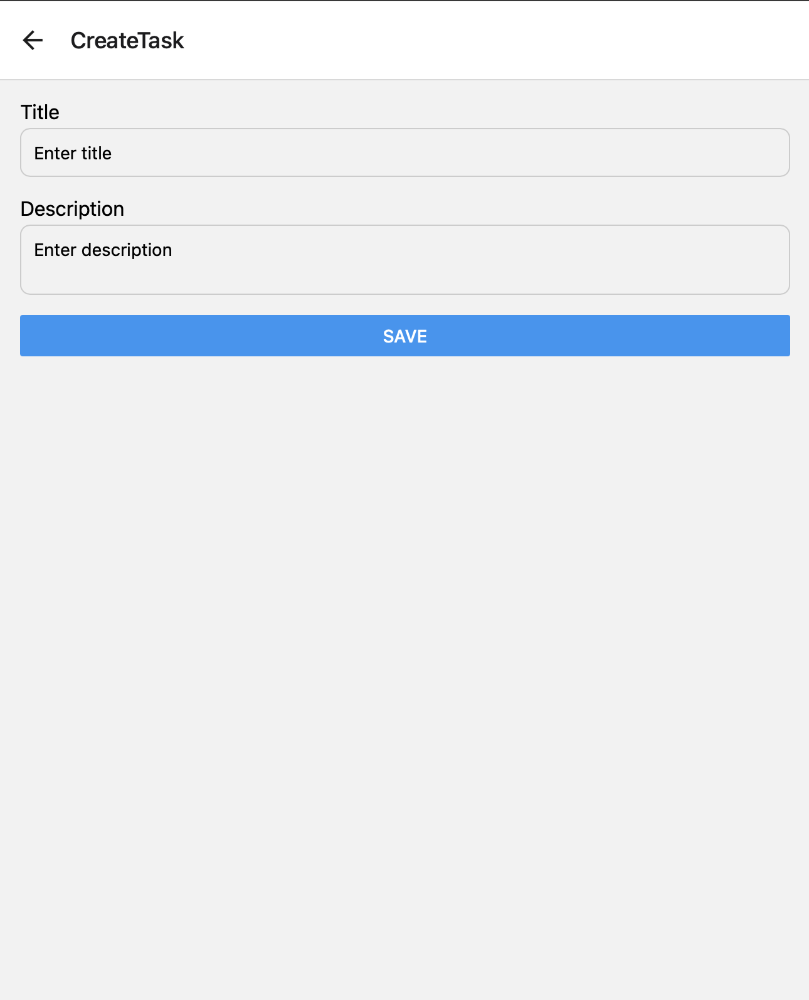

# task-tracker

Clone project from GitHub https://github.com/ivan113/task-tracker

# backend

- Import like Maven project on IntelliJ IDEA or similar the backend folder
- RUN te project
- Call to http://localhost:8080 to test from Postman (Ideally use Swagger for documentate the API)
  - GET http://localhost:8080/api/tasks
  - POST http://localhost:8080/api/tasks
    - BODY `application/json`
    - `{
"title": "Tarea 1",
"description": "Esta es la tarea 1"
}`
  - PUT http://localhost:8080/api/tasks/{id}
- Go to http://localhost:8080/h2-console to show the results of the test

# frontend

### I use Expo instead React Native Cli because is quickliest for this test

- Open frontend/TaskTracker in VS Code
- Run `npm install`
- Run `npm start`
- Aftert this, select the prefered device (w for web browser)

